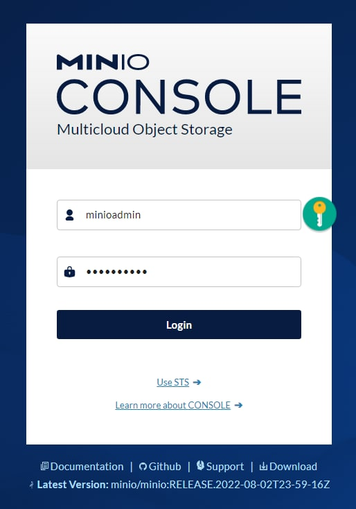
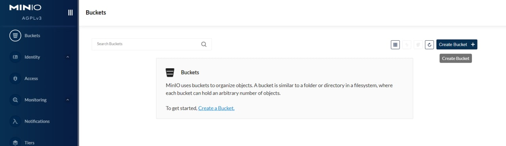
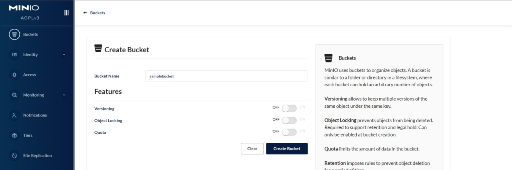
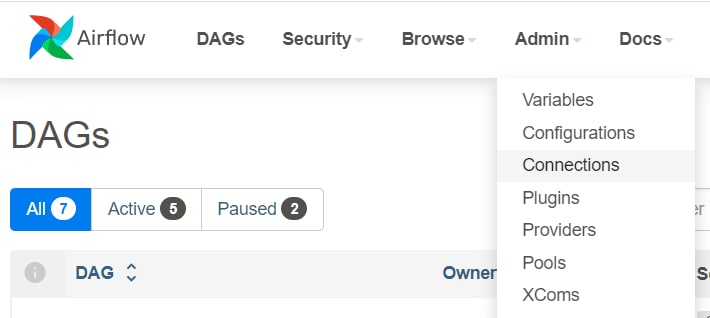
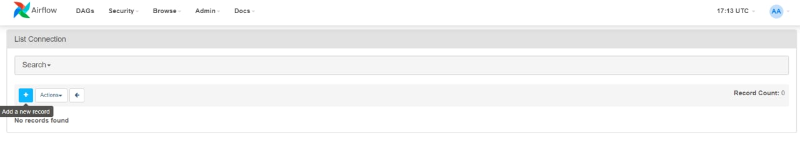
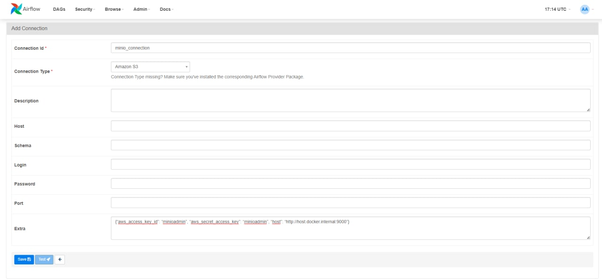
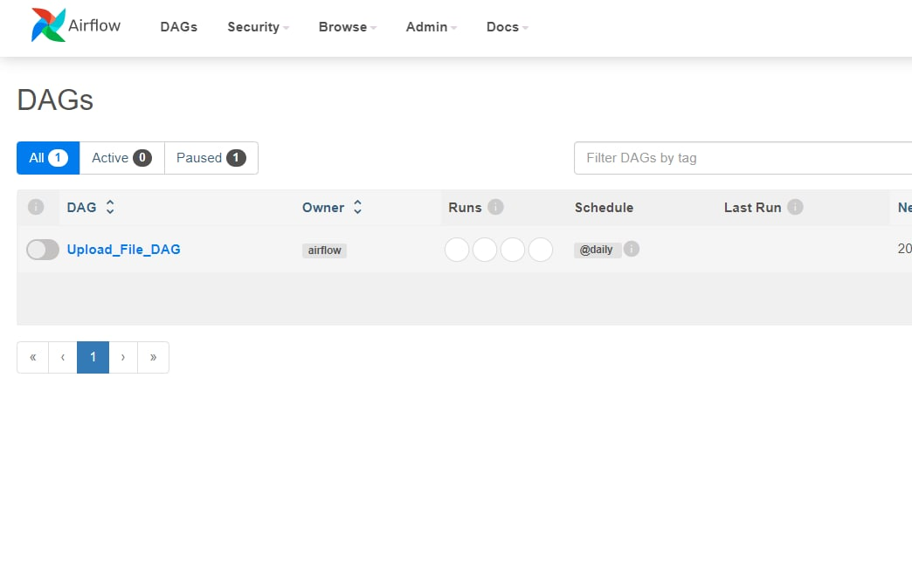
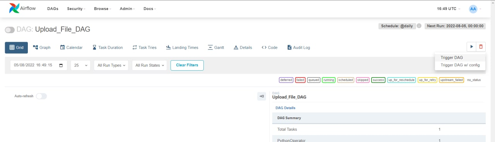
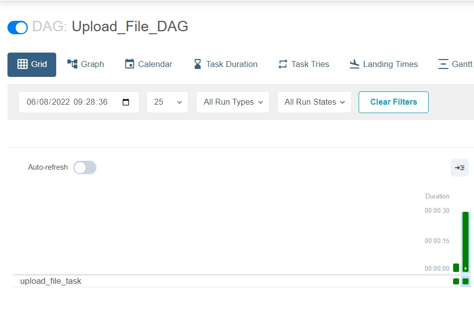
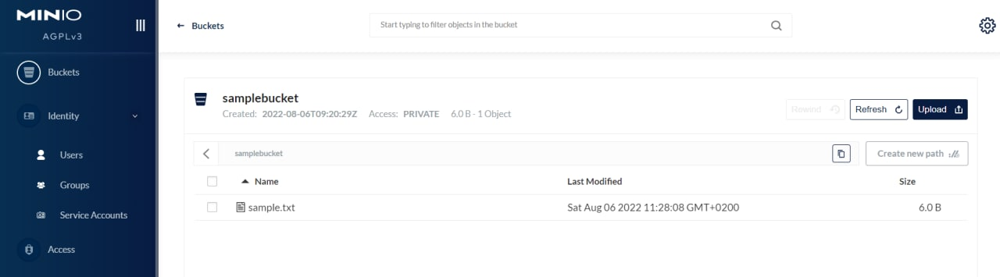

In this tutorial I'll show you how to programmatically upload a file to min.io with Airflow.

For first clone this [repository](http://localhost:9000){:target="_blank"} everywhere you want, then open the folder with visual studio (or even just browse into and open a terminal) and write the following command

> docker compose up -d

Now navigate to: [localhost:9000](http://localhost:9000){:target="_blank"}

Then log in with username = minioadmin and password = minioadmin (that are the same we set in the docker compose)

Click to "Create Bucket"

and then create a bucket with name samplebucket

Now navigate to: [localhost:8080](http://localhost:8080){:target="_blank"}, log in with username = airflow and password = airflow and go to admin then select connections
 

Then click the + to add a new connection

and set:
- connection id as "minio_connection"
- connection typ as "Amazon S3"
- copy and paste the text below in the "extra" field

> `{"aws_access_key_id": "minioadmin", "aws_secret_access_key": "minioadmin", "host": "http://host.docker.internal:9000"}`

as shown in the figure below

Please note that you might have to replace the " because this could be broken after copy and paste.

Now return to the home, select the DAG

and trigger it (click on Trigger DAG)

now you should see the green report as in the figure below

If you return to min.io the file must be uploaded!

See you at the next tutorial

